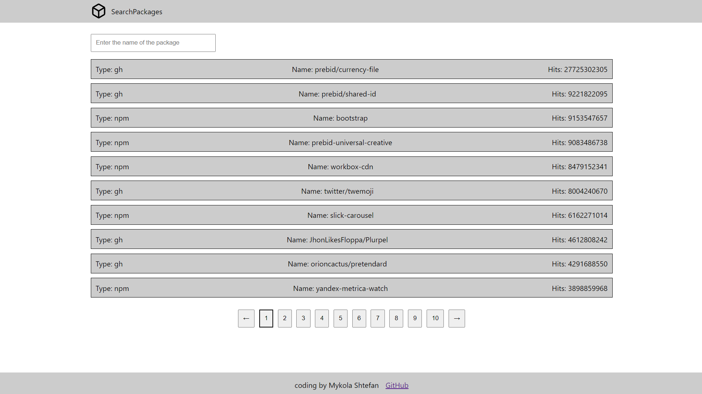

# Project: package-search-app

## Project description:
Small package finder app

## Technologies I used

- Semantic versioning using HTML 5
- Flex
- Scss
- Media queries
- BEM methodology
- JS ES6
- HTTP requests using fetch
- React
- [Algoria search Api](https://www.algolia.com/doc/)

## Installing dependencies

```bash
  npm i
```
## Running a local project

```bash
  npm run serve
```
## Screnshot


## Authors

- [Mykola Shtefan](https://github.com/dreams65)